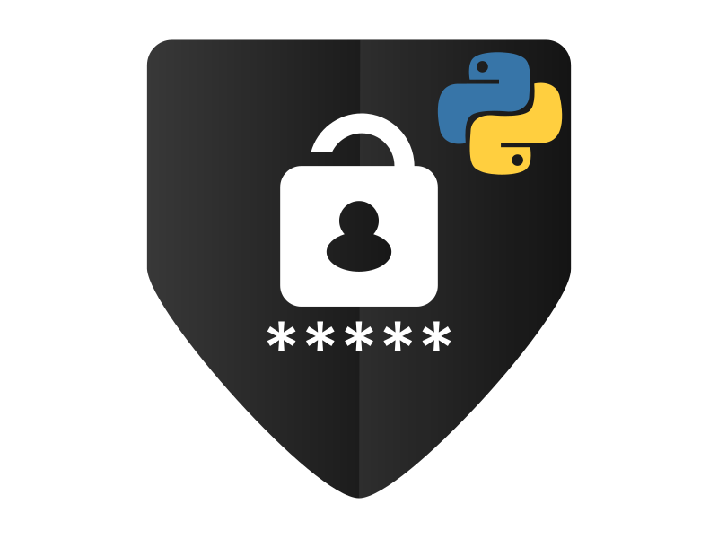

    
    <h1>pyPassGen</h1>
    
Python Password Generator Script

## Description:

**pyPassGen** is a Python GUI application that generates a random password using combinations of lowercase, uppercase, special characters, and digits. The lenght of the password can be chosen manually by the user or have a random lenght between 10-20 characters in lenght. 

## Purpose:

As technology continues to advance in our modernized world, keeping our personal information safe is becoming more difficult. Using strong passwords can help. It is recommended that you use a different password for every application you use. **pyPassGen** can help with this.

### Development:

> Current Status: Developing Version 1.2
> 
> To-Do List:
> 
> > - Build out GUI
> > 
> > - Store generated passwords in database
> > 
> > - Improve security by implementing master password
> 
> Future Plans:
> 
> > - Build Web App using React or Vue and Django

## Contributing:

Please feel free to post any issues you encounter or for features you would like added to the project.
